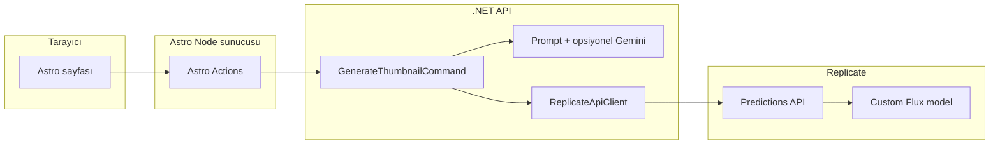

# AI-Driven Blog Thumbnail Generator — Geliştirme Planı

Bu doküman, monorepo içinde Astro (Node adapter) + .NET 10 Web API mimarisini, **Replicate üzerinden özel eğitimli Flux modeli** ile görsel üretimini ve fazlı teslimatı tanımlar.

## Karar Özeti

| Konu | Karar |
|------|--------|
| Repo | Monorepo (`/frontend` Astro, `/backend` .NET) |
| Görsel motor | **Replicate** API; model olarak senin **custom trained Flux** sürümün |
| Astro | `output: 'server'`, `@astrojs/node` adapter |
| İletişim | Astro Actions → .NET API (sunucudan sunucuya); tarayıcı doğrudan .NET’e gitmez |
| CORS | .NET tarafında yalnızca Astro’nun public URL’ine izin |
| Kimlik bilgileri | `.env` (yerel + Docker); .NET’de **Options Pattern** / `IConfiguration` |
| Replicate kimliği | `REPLICATE_API_TOKEN` (Bearer); model için **sürüm / model tanımlayıcı** `.env` ile (kodda `YOUR_REPLICATE_FLUX_VERSION` placeholder) |
| Adobe / Firefly | **Kullanılmıyor** |
| Dil | Türkçe (UI, hata mesajları, prompt üretimi) |
| Metin yok | Yalnızca prompt talimatları; görsel sonrası revizyon yok |
| Oran | **16:9** (Flux / Replicate `input` şemasına uygun alan adları kodda sabitlenir) |
| Veritabanı | Şimdilik yok |
| İsteğe bağlı AI | Ara katman: metinden görsel prompt (ör. **Gemini**); MVP’de mock veya basit kural da mümkün |

---

## Senin Replicate / Flux Tarafında Yapacakların

Bu maddeler kod yazımından bağımsız; model ve token hazır olmadan uçtan uca üretim doğrulanamaz.

### A. Replicate hesabı ve API token

1. [replicate.com](https://replicate.com) hesabında **API token** oluştur.
2. Token’ı `.env` içine koy (`REPLICATE_API_TOKEN`); repoya **asla** commit etme.

### B. Custom trained Flux modeli

1. Eğitimini tamamladığın **Flux tabanlı özel modelini** Replicate’e push et veya Replicate üzerinde oluşturulan model sayfasını aç.
2. Tahmin (prediction) API’si için gereken **model sürümü** bilgisini kopyala (genelde `owner/model` ve belirli bir **version id** hash’i veya dokümantasyondaki tam referans).
3. `.env` içinde projede kullanılacak anahtara yaz (ör. `REPLICATE_FLUX_MODEL_VERSION`). Kodda geliştirme için `YOUR_REPLICATE_FLUX_VERSION` placeholder dokümante edilir; **üretim isteğinde** env değeri zorunlu olacak şekilde doğrulama eklenir.

### C. Girdi şeması (Flux / LoRA)

1. Modelinin Replicate’te beklediği **input alanlarını** not et (`prompt`, `aspect_ratio`, `num_outputs`, vb.). 16:9 için Replicate’in kabul ettiği aspect ratio string’ini (ör. `16:9`) model dokümanına göre doğrula.
2. İlk başarılı tahmini Replicate arayüzünden veya `curl` ile çalıştır; böylece .NET tarafında hata ayıklama kolaylaşır.

### D. Kota ve faturalandırma

1. Replicate kullanım limitlerini ve maliyetleri kontrol et.
2. Uzun süren tahminler için **polling** veya webhook stratejisini (MVP’de genelde polling) göz önünde bulundur.

### E. (İsteğe bağlı) Gemini

1. Google AI Studio veya ilgili konsoldan API anahtarı al.
2. `.env` içine ekle; backend’de yalnızca sunucu tarafında kullanılacak.

---

## Faz 0 — Monorepo ve ortam sözleşmesi

**Kod / yapı (geliştirici)**

- Kök dizinde monorepo: `frontend/` (Astro), `backend/` (.NET 10 Web API).
- Kök `.env.example`: `REPLICATE_API_TOKEN`, `REPLICATE_FLUX_MODEL_VERSION` (veya projede seçilen tek anahtar adı), `GEMINI_API_KEY` (opsiyonel), backend taban URL’si, `CORS_ORIGINS` (Astro’nun URL’si).
- Docker Compose (isteğe bağlı): iki servis, `.env` mount.

**Sen (Replicate)**

- Token + model sürümü bilgisinin hazır olması (B maddesi).

**Çıktı:** Net klasör yapısı, örnek env şablonu.

---

## Faz 1 — .NET 10 API iskeleti (Clean Architecture + MediatR)

**Kod**

- `GenerateThumbnailCommand`: `Title` (opsiyonel), `Content` (zorunlu).
- CQRS handler iskeleti: validasyon, Türkçe hata mesajları için zemin.
- Options: `ReplicateOptions` (base URL `https://api.replicate.com/v1`, token, model version id, varsayılan 16:9 input haritalaması).
- Program.cs / DI: MediatR, Options binding, CORS (Astro origin).

**Sen**

- `.env` ile token/model satırlarını doldur (model henüz yoksa placeholder bırakıp yalnızca API iskeletini çalıştırabilirsin).

**Çıktı:** Ayağa kalkan API, Swagger veya minimal health endpoint.

---

## Faz 2 — Replicate API istemcisi (OAuth yok)

**Kod**

- `IReplicateApiClient` / `ReplicateApiClient`: `HttpClient`, `Authorization: Bearer {REPLICATE_API_TOKEN}`.
- Tahmin oluşturma: `POST /v1/predictions` (veya model dokümantasyonuna göre `POST /v1/models/{owner}/{name}/predictions`) — tek bir tutarlı yol seçilir.
- Yanıtta `get` URL ile **polling** (status `succeeded` / `failed`); timeout ve iptal politikası.
- Hatalarda anlamlı exception veya `Result` + log.

**Sen**

- Tek bir başarılı prediction’ı Replicate panel veya curl ile doğrula; dönen JSON’daki çıktı URL alan adını (ör. `output` dizisi) not et.

**Çıktı:** Token + version ile uçtan uca bir görsel URL’si dönen servis.

---

## Faz 3 — Flux görsel üretimi (thumbnail akışı)

**Kod**

- Prompt’u (Faz 4’ten) Replicate `input` nesnesine bağla: **16:9**, metin içermeme talimatları prompt içinde.
- Model sürümü env’den; placeholder yalnızca dokümantasyon/örnek — çalışma anında eksikse net hata.
- Handler çıktısı: görsel URL(leri) veya frontend’in göstereceği tek ana URL.

**Sen**

- Kendi Flux modelinin desteklediği `input` alanlarına göre ince ayar (ör. adım sayısı, guidance) ihtiyacını belirt; gerekirse Options’a ekle.

**Çıktı:** `GenerateThumbnailCommand` → Replicate → görsel.

---

## Faz 4 — Prompt üretimi (Türkçe, metin yok)

**Kod**

- Başlık varsa / yoksa: Türkçe görsel betimlemesi + “yazı, harf, logo metni yok” talimatları.
- Opsiyonel: `IGeminiPromptService` ile blog metninden kısa görsel prompt; anahtar yoksa fallback.

**Sen**

- Türkçe prompt + Flux çıktı kalitesini örnek içeriklerle dene.

**Çıktı:** Tutarlı prompt girdisi.

---

## Faz 5 — Astro frontend (Node adapter + Tailwind + Actions)

**Kod**

- `output: 'server'`, Node adapter; form + Actions ile .NET’e server-side `fetch`.
- Tailwind; loading / hata / başarı (Türkçe).
- Görsel kartı.

**Sen**

- Yerel Astro origin’inin CORS’ta tanımlı olduğundan emin ol.

**Çıktı:** Form → Action → .NET → Replicate → görsel.

---

## Faz 6 — Hata yönetimi ve sertleştirme

**Kod**

- .NET: Replicate 4xx/5xx, prediction `failed`, timeout.
- Astro: Action `try/catch`, kullanıcıya anlaşılır mesaj.
- Startup yapılandırma doğrulaması.

**Sen**

- Bilerek hatalı token veya geçersiz version ile UI mesajını doğrula.

**Çıktı:** Güvenilir demo.

---

## Faz 7 — Docker ve dokümantasyon

**Kod**

- Dockerfile’lar + `docker-compose.yml`; `.env`.
- Kısa çalıştırma notu (isteğe bağlı README).

**Sen**

- Production URL’leri ve CORS güncellemesi.

**Çıktı:** Tek komutla local stack (hedef).

---

## Bağımlılık Grafiği (özet)

---

## Sonraki Adım

Faz 0–1 ile monorepo ve API iskeleti; Faz 2–3 ile Replicate token + model sürümü ve Flux tahmini. Senin tarafında **Replicate model version** ve **API token** hazır olduğunda uçtan uca doğrulama yapılır.
# Poster metinleri (kısa sürüm)

> Kutulara doğrudan yapıştırılabilir; gerekirse bir satır daha kısaltın.

---

## Başlık (banner)

**BLOG YAZILARI İÇİN THUMBNAIL ÜRETİCİSİ**

---

## Öğrenci adları

*[Ad Soyad]*

---

## Özet

Kullanıcının girdiği Türkçe blog metni, **Gemini** tabanlı bir dil modeli (**OpenRouter**) ile tek bir **İngilizce** görsel betimlemesine dönüştürülür. Bu metne sabit **vektör stil** soneki eklenerek **Replicate**’te çalışan modele gönderilir; **16:9** küçük resim üretilir. Arayüz **Astro**, API **.NET**’tir; tekrarlar için **snippet** kaydı vardır.

---

## Problem ve soru cümlesi

Blog için **16:9** thumbnail hazırlamak zaman ve tasarım bilgisi ister; görsel modelleri ise kısa **İngilizce** promptla daha iyi çalışır.

**Soru:** Türkçe metinden otomatik İngilizce prompt ve vektör stilde uçtan uca görsel üretimi nasıl kurgulanır?

---

## Giriş

**Amaç:** Tek formdan, kod bilgisi olmadan bloga uygun vektör thumbnail almak.

**Neden LLM?** Uzun Türkçe metin yerine kısa İngilizce sahne betimlemesi, üretimi daha tutarlı yapar.

---

## Yöntem

1. Web formu → **.NET API**  
2. **OpenRouter / Gemini:** Türkçe → İngilizce görsel promptu  
3. **PromptComposer:** vektör stil soneki ekleme  
4. **Replicate:** görsel üretimi (**aspect_ratio: 16:9**)  
5. Tarayıcıda önizleme, indirme, **JSON snippet**

---

## Bulgular

- Uçtan uca akış çalır; Replicate’e giden **tam prompt** arayüzde izlenebilir.  
- **16:9**, model şeması izin verdiği sürece yapılandırma ile sağlanır.  
- Snippet ile **kredi tasarrufu** ve sunum tekrarı mümkündür.

*(Kutu için: 1–2 örnek görsel veya akış şeması.)*

---

## Sonuç ve tartışma

**Dil modeli + görsel model** iki aşaması, prompt yükünü azaltır ve stili sabitler. **Kısıt:** API kotası, model şeması ve telif/etik kullanım kuralları.

---

## Öneriler

- Farklı **stil sonekleri**; kullanıcıya üretim öncesi **prompt düzenleme**.  
- Aynı metin için **önbellek** ile maliyet düşürme.  
- Model slug ve Replicate **API şemasını** güncel tutma.

---

## Teşekkür

*[Danışman / destek — kısa]*

---

## Kaynaklar

openrouter.ai · replicate.com · astro.build · learn.microsoft.com/aspnet/core
